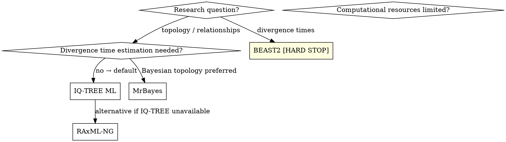

# Inferring Phylogenetic Trees

## Overview

Select the inference method based on the research question, run the analysis, assess support and convergence, and sanity-check the topology against known biology before proceeding to visualization.

## Step 1 — Read upstream reports

Load `reports/[planX/]model-selection_YYYY-MM-DD.md`. Extract:
- Best-fit model string(s) or `.best_model.nex` partition file path
- Aligned matrix and partition file paths
- Downstream goal (topology only, divergence times, phylodynamics)

Also load `reports/research-design_YYYY-MM-DD.md` to recall the biological question — it determines which method is appropriate.

## Step 2 — Choose inference method



**Default: IQ-TREE ML.** Use MrBayes when the researcher specifically wants posterior probabilities or full Bayesian inference. Use BEAST2 only for divergence time — it requires a hard human approval gate (see below).

## Step 3a — IQ-TREE (ML, primary)

```bash
# Standard ML + ultrafast bootstrap (UFBoot)
iqtree2 -s concatenated.fasta -p partition.best_model.nex \
  -B 1000 -T AUTO --prefix output/tree_inference

# With SH-aLRT test in addition to UFBoot (recommended)
iqtree2 -s concatenated.fasta -p partition.best_model.nex \
  -B 1000 --alrt 1000 -T AUTO --prefix output/tree_inference

# Single marker, no partition file
iqtree2 -s aligned.fasta -m GTR+F+I+G4 -B 1000 -T AUTO \
  --prefix output/tree_inference
```

**Key outputs:**
- `*.treefile` — best ML tree with support values
- `*.contree` — consensus tree
- `*.iqtree` — full log with tree and model details

**Support value thresholds:**

| Method | Flag | Reliable threshold | Note |
|--------|------|--------------------|------|
| UFBoot | `-B` | ≥95 | UFBoot values are inflated; ≥95 ≈ ≥70 standard bootstrap |
| Standard bootstrap | `-b` | ≥70 | Slower; use `-b 100` minimum, `-b 1000` preferred |
| SH-aLRT | `--alrt` | ≥80 | Fast; use alongside UFBoot for independent support |

Report both UFBoot and SH-aLRT when both are run. A node is well-supported when both exceed thresholds.

## Step 3b — RAxML-NG (ML, alternative)

```bash
# Model test + ML inference + bootstrap
raxml-ng --all --msa concatenated.fasta --model partition.txt \
  --bs-trees 1000 --prefix output/raxml_tree --threads auto
```

Key output: `*.support` tree with bootstrap values mapped onto best ML tree.

## Step 3c — MrBayes (Bayesian topology)

```bash
# Run interactively or via batch script
mb mrbayes_block.nex
```

Minimal MrBayes block:
```
begin mrbayes;
  charset matK = 1-873;
  charset rbcL = 874-1423;
  partition genes = 2: matK, rbcL;
  set partition = genes;
  lset applyto=(1) nst=6 rates=gamma ngammacat=4;
  lset applyto=(2) nst=2 rates=gamma ngammacat=4;
  prset applyto=(all) ratepr=variable;
  mcmcp ngen=10000000 samplefreq=1000 printfreq=1000 nchains=4 nruns=2;
  mcmc;
  sumt burnin=2500;
  sump burnin=2500;
end;
```

**Convergence assessment (run before accepting results):**
```bash
# Check in MrBayes output or Tracer
# Key diagnostics:
# - Average standard deviation of split frequencies (ASDSF) < 0.01
# - Potential scale reduction factor (PSRF) ≈ 1.0 for all parameters
# - ESS > 200 for all parameters (check in Tracer)
```

Open the `.p` files in Tracer to visualize trace plots. A well-mixed chain shows a fuzzy caterpillar shape — not trending or stuck.

**Support threshold:** Posterior probability ≥ 0.95 for well-supported nodes.

**If convergence fails:** Increase `ngen`, check for model misspecification, or inspect for long-branch taxa. Route to `phylo-debug`.

## Step 3d — BEAST2 (divergence time estimation)

### ⚠ HARD STOP — Human approval required before this step

Before configuring or running BEAST2:

1. Propose candidate calibration points from the literature (fossil constraints, secondary calibrations from published dated trees)
2. For each calibration: provide taxon/node, age estimate, prior distribution (lognormal/uniform/normal), and literature source
3. **Present to researcher and PAUSE** — do not proceed until the researcher explicitly approves the calibration scheme
4. Record the approval in the report

Only after approval:

```bash
# Set up XML in BEAUti (GUI) or script it
# Key settings to document: clock model, tree prior, calibration priors, chain length
beast -threads 4 beast_run.xml

# Assess convergence in Tracer
# All parameters ESS > 200
# Inspect trace plots for stationarity

# Summarize trees
treeannotator -burnin 25 -heights mean beast_run.trees beast_mcc.tree
```

**Required convergence diagnostics for BEAST2:**
- All ESS values ≥ 200 in Tracer (especially TreeHeight, clockRate, all model parameters)
- Trace plots show stationarity (no trend after burn-in)
- Effective sample size for tree topology assessed via `phylobayes` or similar if needed

**If ESS < 200:** Extend chain length (multiply by ×2–×5); do not report results from unconverged runs.

## Step 4 — Topology sanity check

After any inference method, verify the tree makes biological sense before reporting:

- Does the outgroup root the tree correctly?
- Are well-established clades (from literature review) recovered?
- Are there any extreme long branches that suggest misidentified or chimeric sequences?
- Do support values align with known difficult nodes (expect low support in rapid radiations)?

Flag any unexpected topology to the researcher with a specific question — do not silently proceed. Unexpected results may indicate a data problem (→ `phylo-debug`) or genuine novel finding (→ document carefully).

## QC Gate

| Check | Threshold | Action on failure |
|-------|-----------|-------------------|
| UFBoot support | Key nodes ≥95 | Check alignment quality; route to `phylo-debug` |
| SH-aLRT support | Key nodes ≥80 | As above |
| Posterior probability | Key nodes ≥0.95 | Extend MCMC run |
| MrBayes ASDSF | <0.01 | Extend `ngen`; route to `phylo-debug` |
| BEAST2 ESS | All parameters ≥200 | Extend chain; do not report |
| Outgroup placement | Correct per literature | Inspect for long-branch attraction |
| BEAST2 calibrations | Human-approved | Cannot proceed without approval |

## Report

Write to `reports/[planX/]tree-inference_YYYY-MM-DD.md`:

```markdown
# Tree Inference Report
Date: YYYY-MM-DD
Plan: [planA / planB / ...]

## Method
- Tool: IQ-TREE [version] / RAxML-NG / MrBayes / BEAST2
- Justification for method choice

## Configuration
- Model(s) applied: [model string or partition file path]
- Bootstrap replicates / MCMC generations
- Other key parameters

## Support Summary
| Node / Clade | UFBoot | SH-aLRT | PP | Notes |
|-------------|--------|---------|-----|-------|

## Convergence Diagnostics (Bayesian only)
- ASDSF (MrBayes): [value]
- PSRF: [value]
- ESS (all parameters ≥200): [pass / fail — list any <200]

## BEAST2 Calibration Record (if applicable)
| Node | Age prior | Distribution | Source | Human-approved |
|------|-----------|-------------|--------|---------------|

## Topology Notes
[Well-supported clades recovered, unexpected results, long branches]

## Output Files
[Tree file paths — .treefile, .contree, .mcc.tree, etc.]

## Software Versions
| Tool | Version | Source | Install date |
|------|---------|--------|-------------|

## Next Module
phylo-visualization
```

## Common Mistakes

| Mistake | Fix |
|---------|-----|
| Treating UFBoot ≥70 as reliable (like standard bootstrap) | UFBoot threshold is ≥95, not ≥70; the scales are different |
| Running BEAST2 without human calibration approval | This is a hard gate — stop and present calibrations first, always |
| Accepting Bayesian results without checking convergence | ESS and trace plots are mandatory, not optional |
| Extending a non-converging MrBayes run indefinitely | Check for model misspecification or problematic taxa first |
| Skipping the topology sanity check | Unexpected topologies are data problems until proven otherwise |
| Using `-b 100` standard bootstrap for publication | Use `-B 1000` UFBoot + `--alrt 1000` or `-b 1000` standard at minimum |
