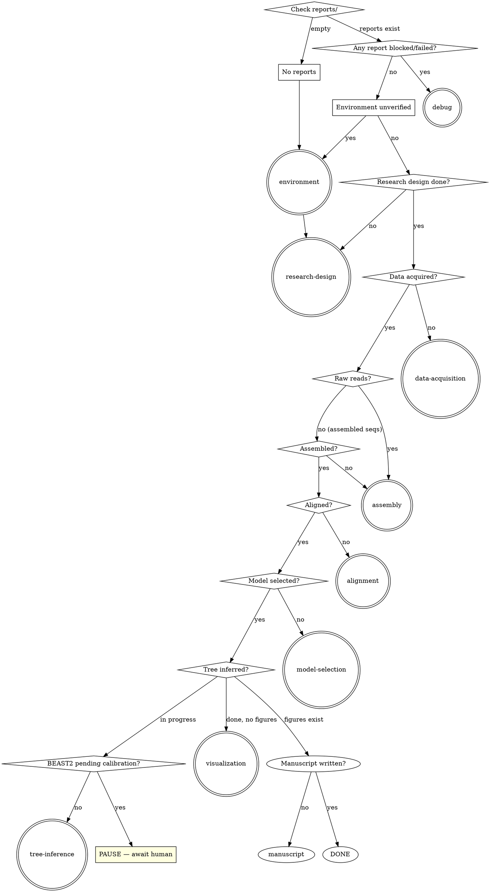

# Phylogenetic Analysis Pipeline

## Overview

Entry point and coordinator for the full phylogenetic analysis pipeline. Reads checkpoint reports to determine where the researcher is, routes to the correct module, and tracks state across sessions.

## Pipeline modules

```
environment       → software setup and version management
research-design   → literature review, question definition, study design
data-acquisition  → GenBank/SRA survey, sampling plans, download
assembly          → plastome/marker assembly from raw SRA reads
alignment         → per-marker alignment, trimming, concatenation
model-selection   → substitution model testing (ModelFinder/ModelTest-NG)
tree-inference    → ML/Bayesian tree inference, support, convergence
visualization     → R-based annotated publication figures
manuscript        → Methods section drafting, figure captions, journal formatting
debug             → diagnosis and fix for any pipeline failure
```

## Step 1 — Assess researcher level

Before anything else, ask one question to gauge experience. Calibrate explanation depth for the entire session.

## Step 2 — Determine pipeline state

Check the `reports/` directory for existing checkpoint reports:



## Step 3 — Handle multiple plans

If `reports/planA/`, `reports/planB/` etc. exist, check state independently per plan. A plan may be at a different stage than others — resume each from its own checkpoint.

Present the researcher with a status summary across all plans before routing:

```
Plan A: alignment complete → ready for model selection
Plan B: assembly in progress → resume the assembly skill
```

## Step 4 — Route to module

Invoke the appropriate module skill based on the routing logic above. Pass relevant context:
- Path to the most recent report for that module's stage
- Plan identifier (if multi-plan)
- Researcher experience level (established in Step 1)

## Step 5 — Track and summarize

After each module completes, return to this hub. Update the researcher on overall pipeline progress:

```
Completed: environment ✓, research design ✓, data acquisition ✓, assembly ✓
In progress: alignment (Plan A complete, Plan B running)
Remaining: model selection → tree inference → visualization → manuscript
```

Ask whether to continue to the next module or pause.

## Report index

After each session, note the current pipeline state in a brief index entry appended to `reports/pipeline-status.md`:

```markdown
## Session YYYY-MM-DD
- Plans active: [planA, planB]
- Plan A status: [last completed module]
- Plan B status: [last completed module]
- Pending human actions: [BEAST2 calibration approval / none]
- Next recommended action: [module + plan]
```

This ensures both the researcher and a future AI agent instance can orient immediately at session start.

## Common Mistakes

| Mistake | Fix |
|---------|-----|
| Routing to a module without checking reports/ first | Always read existing reports — re-running completed steps wastes time and overwrites results |
| Treating all plans as synchronized | Each plan has independent state; check and route each separately |
| Proceeding past a blocked/failed report | Any `blocked` or `failed` status routes to `debug` first, always |
| Skipping `environment` at session start on a new machine | Environment must be verified even if reports exist — tools may not be installed |
| Not updating `pipeline-status.md` at session end | Without this, the next session starts cold with no orientation |
